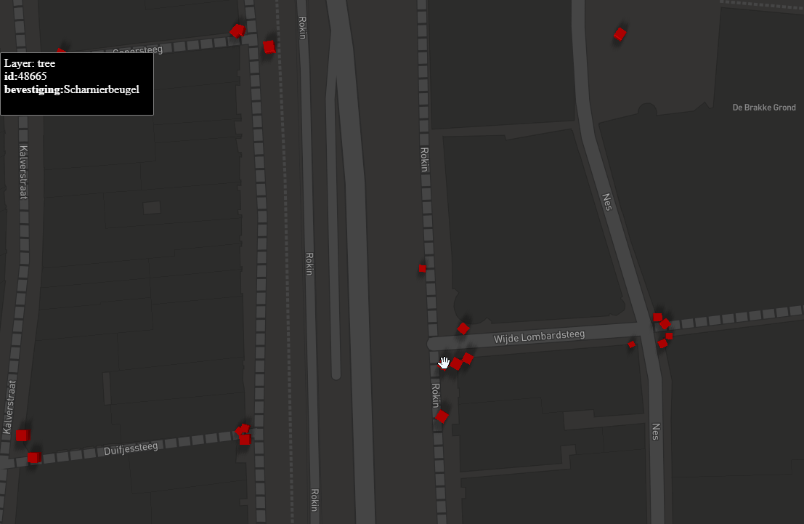
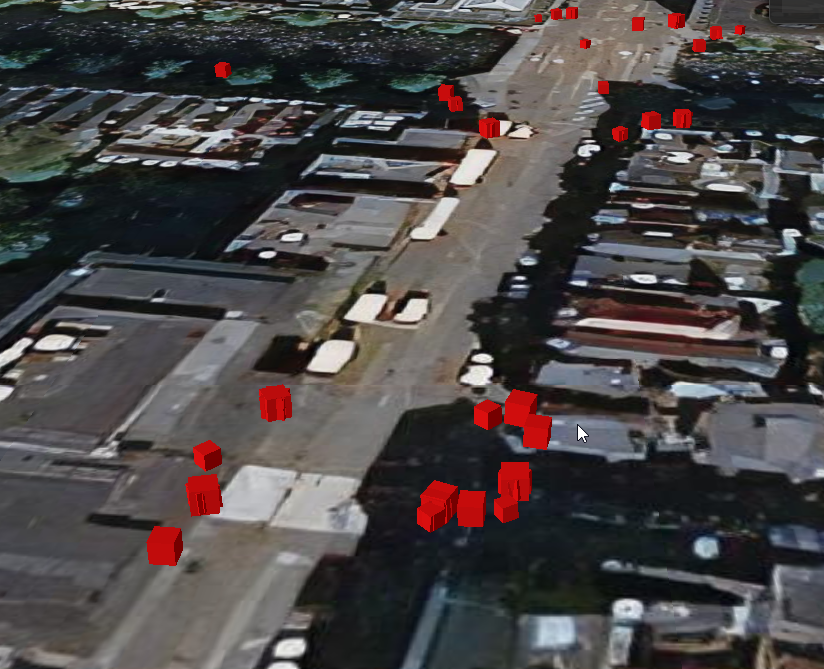

# i3dm.export getting started

In this document we run i3dm.export on a sample dataset of traffic signs (GeoJSON file). The generated instanced 3D tiles are visualized using a simple glTF 
box in a MapBox GL JS viewer and Cesium client.

## Prerequisites

Some open source tooling is used in this tutorial:

- wget https://www.gnu.org/software/wget/

- Docker https://www.docker.com/get-started

- ogr2ogr https://gdal.org/programs/ogr2ogr.html

- psql https://www.postgresql.org/docs/9.2/app-psql.html

- .NET 5.0 https://dotnet.microsoft.com/download/dotnet/5.0

- Python 3 https://www.python.org/

## Download data

```
$ wget https://raw.githubusercontent.com/Amsterdam/mlvb/master/output/asset-registration/current_traffic_signs.geojson
```

## Setup PostGIS

Start PostGIS database

```
$ docker run -d -e POSTGRES_PASSWORD=postgres -p 5432:5432 mdillon/postgis
```

## Import traffic signs to PostGIS

```
$ ogr2ogr -f "PostgreSQL" PG:"host=localhost user=postgres password=postgres dbname=postgres" current_traffic_signs.geojson -nlt POINT -nln traffic_signs
```

## PSQL into PostGIS

PSQL into PostGIS and do a count on the traffic signs:

```
$ psql -U postgres -h localhost

postgres=# select count(*) from traffic_signs;
 count
-------
 58999
(1 row)
```

## Create instances table

We create a new table, with 

- trees in epsg:4326;

- Box.glb as model;

- randomized scales;

- randomized horizontal rotations;

- for tags use fields 'id' and 'bevestiging' . 

```
postgres=# CREATE TABLE traffic_signs_instances as (
	SELECT ogc_fid as id, 
	st_transform(wkb_geometry, 4326) as geom,
	1 +  random() as scale,
	random()*360 as rotation,
	'Box.glb' as model,
	json_build_array(json_build_object('id',ogc_fid), json_build_object('bevestiging',bevestiging)) as tags
	from traffic_signs
);

postgres=# CREATE INDEX geom_idx ON traffic_signs_instances USING GIST (geom);
postgres=# delete from traffic_signs_instances where st_x(geom) < 4.5 or st_x(geom)>5.0;
postgres=# exit;
```
## Install i3dm.export

```
$ dotnet tool install -g i3dm.export
```

## Run i3dm.export on instance table

When visualizing in MapBox add the -f mapbox parameter:

```
$ i3dm.export -c "Host=localhost;Username=postgres;password=postgres;Port=5432" -t  traffic_signs_instances -f mapbox
```

When visualizing in Cesium add the -f cesium parameter:

```
$ i3dm.export -c "Host=localhost;Username=postgres;password=postgres;Port=5432" -t  traffic_signs_instances -f cesium
```

Here we visualize the traffic lights all instances as a simple red box (box.glb), but any glTF model can be used instead.

An 'output' directory will be created with a tiles subdirectory containing tileset.json and i3dm tiles.

## Visualize in MapBox GL JS

Put the MapBox client (index.html and mapbox3dtiles.js from directory samples/traffic_lights/mapbox ) and the output folder with tiles on a webserver:

```
$ python3 -m http.server
Serving HTTP on 0.0.0.0 port 8000 (http://0.0.0.0:8000/) ...
```

Navigate in a browser to http://localhost:8000 and the traffic signs should be visible. When moving with mouse over a 
sign you should be able to see the 'id' and 'bevestiging' tags in the upperleft popup.  

Result should look like:

Live demo: https://geodan.github.io/i3dm.export/docs/index.html



## Visualize in Cesium

Put the Cesium client (index.html and from directory samples\traffic_lights\cesium ) and the output folder with tiles on a webserver.

Live demo: todo

Result should look like:



Live demo: https://geodan.github.io/i3dm.export/samples/traffic_lights/mapbox/#16.79/52.367926/4.89836/0/45


