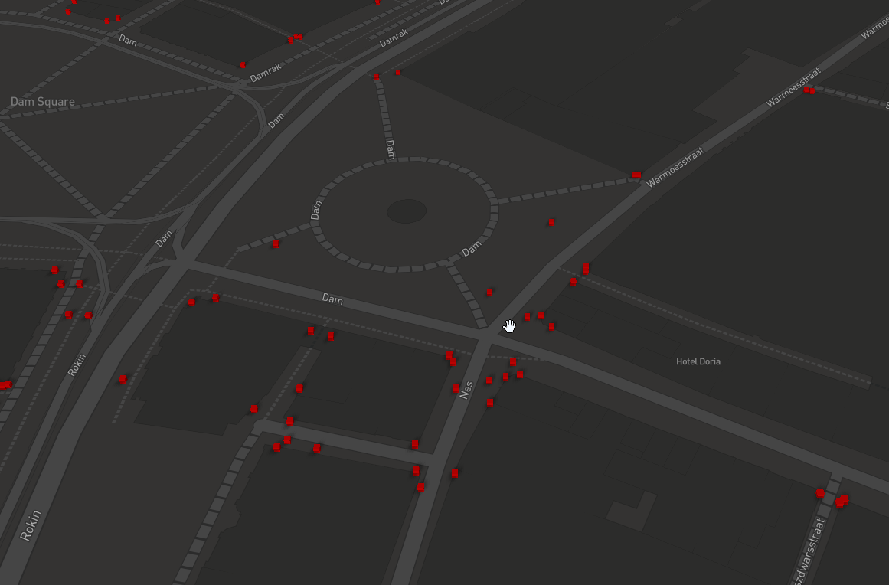

# i3dm.export getting started

In this document we run i3dm.export on a sample dataset of traffic signs (GeoJSON file). The generated instanced 3D tiles are visualized in a MapBox GL JS viewer.

## Download data

```
$ wget https://raw.githubusercontent.com/Amsterdam/mlvb/master/output/asset-registration/current_traffic_signs.geojson
```

## Setup PostGIS

Start PostGIS database

```
$ docker run -d -e POSTGRES_PASSWORD=postgres -p 5432:5432 mdillon/postgis
```

## Import traffic signs to PostGIS

```
$ ogr2ogr -f "PostgreSQL" PG:"host=::1 user=postgres password=postgres dbname=postgres" current_traffic_signs.geojson -nlt POINT -nln traffic_signs
```

## PSQL into PostGIS

PSQL into PostGIS and do a count on the traffic signs:

```
$ psql -U postgres -h localhost

postgres=# select count(*) from traffic_signs;
 count
-------
 58999
(1 row)
```

## Create instances table

```
postgres=# CREATE TABLE traffic_signs_instances as (
	SELECT ogc_fid as id, 
	st_transform(wkb_geometry, 4326) as geom,
	1 as scale,
	0 as rotation,
	null::json as tags
	from traffic_signs
)

postgres=# CREATE INDEX geom_idx ON traffic_signs_instances USING GIST (geom);
postgres=# delete from traffic_signs_instances where st_x(geom) < 4.5 or st_x(geom)>5.0
```

todo: fill tags, rotation, scales

## Install i3dm.export

```
$ dotnet tool install -g i3dm.export
```

## Run i3dm.export on instance table

```
$ i3dm.export -c "Host=localhost;Username=postgres;password=postgres;Port=5432" -t  traffic_signs_instances -m box.glb
```

an 'output' directory will be created with a tiles subdirectory containing i3dm tiles.

todo: use other model for tree.glb

## Visualize in MapBox GL JS

Put the MapBox client (index.html) on a webserver 

```
$ python3 -m http.server
Serving HTTP on 0.0.0.0 port 8000 (http://0.0.0.0:8000/) ...
```

Navigate in a browser to http://localhost:8000 and the traffic signs should be visible.

Result should look like:




